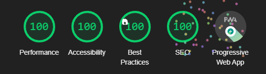

# RO

Am încercat să imit pagina principală de pe elefant.ro. Tot ce ține de design le aparține celor de la elefant, în afară de diferitele iconuri care provin din surse diferite, pe care le-am menționat într-un fișier care se poate găsi în codul sursă.
Am considerat că este un exercițiu bun pentru a învăța mai bine să lucrez cu NextJS și pentru a-mi dezvolta capabilitățile de fullstack, în special pe cele de frontend. În urma dezvoltării aplicației am avut multe de învățat, de exemplu diferite aspecte legate de accesibilitate, viteza paginii, așezarea în pagină, slider cu imagini creat de la 0, fără alte pachete terță, dar și multe funcționalități oferite de NextJS.
Datele prezente pe pagină sunt în mare parte introduse în mod dinamic, dintr-o bază de date (pe care am fost nevoit s-o înlocuiesc cu fișiere JSON deoarece nu dispun de o bază de date care să funcționeze în producție), prin intermediul unui REST API.
Aplicația este Progressive Web App și poate fi instalată pe telefon.
În urma testării cu Lighthouse am obținut un scor mediu de 100, atât pe desktop cât și pe mobil. Pentru testare am folosit o pagină incognito în Google Chrome.

Tech stack: React, NextJS, NodeJS, MongoDB, SCSS.
